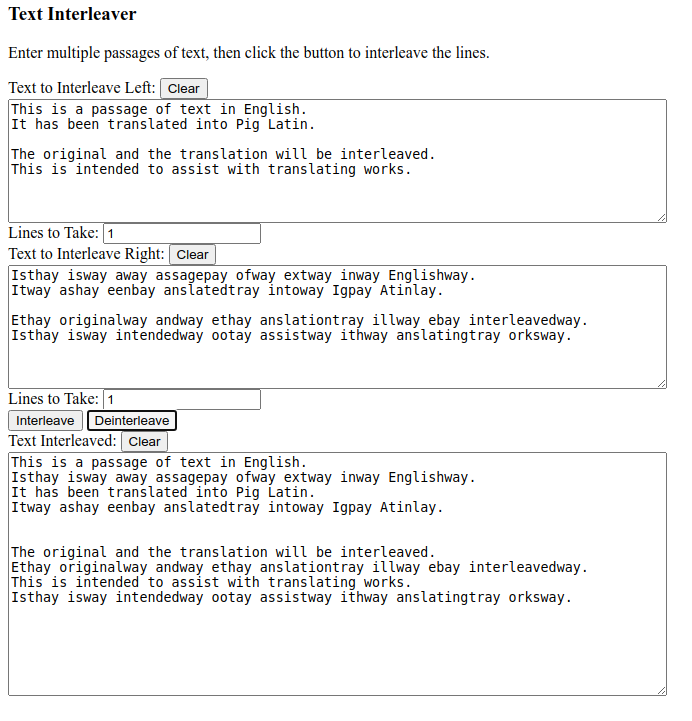

TextInterleaver
===============

A utility to interleave lines of two or more passages of text, implemented in JavaScript.

To run, open Source/TextInterleaver.html in a web browser that runs JavaScript.

</img>
